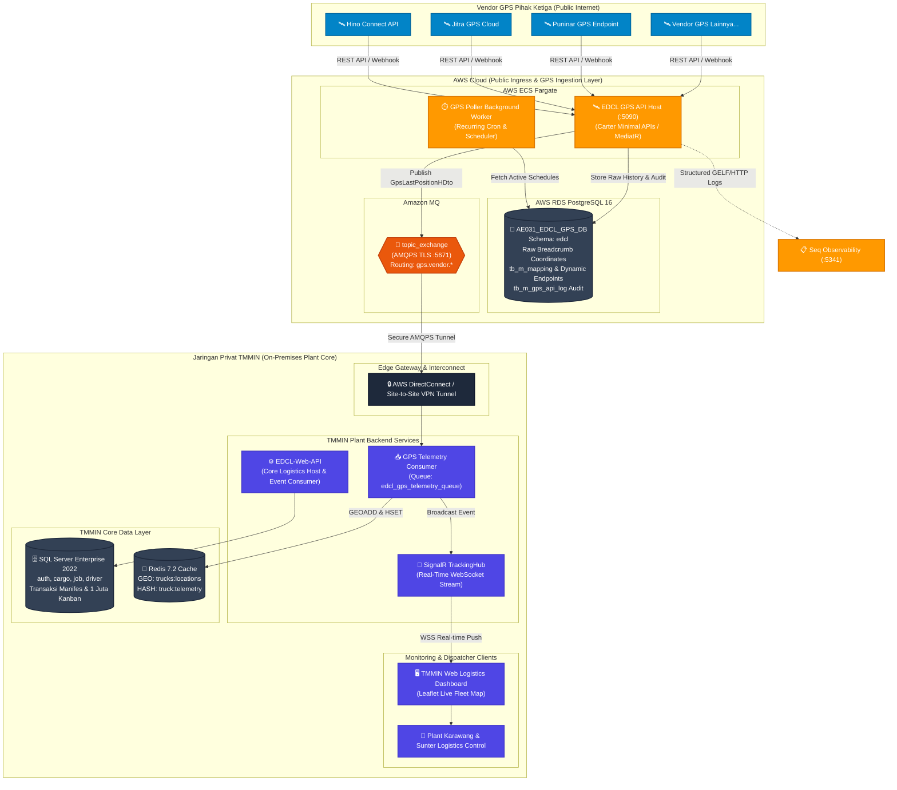

<div align="center">

# 🛰️ EDCL GPS API — Fleet GPS Tracking & Ingestion Service

**Layanan mikro penyerapan data GPS tracking armada real-time berstandar *Enterprise* untuk ekosistem logistik Toyota Motor Manufacturing Indonesia (TMMIN).**

[](https://dotnet.microsoft.com)
[](https://www.postgresql.org)
[](https://aws.amazon.com/fargate)
[](https://aws.amazon.com/amazon-mq)
[](https://aws.amazon.com/rds)
[](https://github.com/CarterCommunity/Carter)
[](https://github.com/jbogard/MediatR)
[](https://datalust.co/seq)

</div>

---

## 📖 Ringkasan Eksekutif

**EDCL GPS API** (`EDCLGPSAPI`) adalah layanan mikro khusus (*specialized ingestion microservice*) yang dirancang untuk menangani penyerapan (*ingestion*), standardisasi, dan pengaliran (*streaming*) data koordinat pelacakan GPS armada truk logistik pemasok komponen suku cadang secara *real-time*.

Layanan ini beroperasi di garis terdepan (*Public Edge*) untuk mengumpulkan data telemetri dari beragam vendor GPS pihak ketiga (*Hino Connect, Jitra GPS, Puninar, EasyGo, dll.*) melalui internet publik, menormalkan format data yang beraneka ragam melalui mesin pemetaan dinamis, lalu mengalirkannya secara aman dan andal ke **`EDCL-Web-API`** yang berada di dalam **Jaringan Privat / Intranet TMMIN (On-Premises Plant Core)**.

### Nilai Strategis Pemisahan Service:
1. **Isolasi Beban Write-Heavy**: Ratusan armada truk logistik mengirimkan titik koordinat setiap 1 menit (menghasilkan akumulasi rekam jejak GPS dalam volume masif setiap harinya). Pemisahan ke layanan ini menjamin server database transaksional inti di pabrik TMMIN (*SQL Server*) terbebas 100% dari beban *I/O disk* koordinat mentah.
2. **Keamanan Jaringan Korporat (Zero Direct Inbound)**: Server pabrik TMMIN tidak perlu membuka port publik ke internet untuk vendor GPS. Seluruh penyerapan data berlangsung di komputasi *cloud*, lalu disalurkan melalui jalur privat terenkripsi (*TLS/VPN*).
3. **Agilitas Integrasi Vendor**: Struktur data vendor pihak ketiga bervariasi dan dapat berubah sewaktu-waktu. Mesin *dynamic mapping* berbasis dokumen PostgreSQL (`JSONB`) memungkinkan penambahan vendor baru tanpa perlu merilis ulang kode backend pabrik.

---

## 🏛️ Arsitektur Sistem Hybrid Cloud (TMMIN Production Integration)

Pada skala produksi industri di Toyota Motor Manufacturing Indonesia (TMMIN), sistem ini menerapkan arsitektur terdistribusi **Hybrid Cloud**:



<div align="center">

[](https://mermaid.live/edit#pako:eNqVV21TIjkQ_itdbK2lV4K8KcJdbRUCyq6wiwylH9YrKjMTIOdMgklG1xP_-3WSAQeEPZ0POpN0dzpPP_0kPOcCEdJcA3JTSeYzGLVvOeATRESpNp0AeVQwYVHU-DSZ1OvF4qHSUtzRxqewXqsVT9LP_CML9axRnv86DEQkpLGe_LkRSvC5pHEarUTL9Yq_ilaclGpl8pFoD5SHQqbRiuXTalB7jVY5qZPSR6IFQtI0VnVSPaHHq1jVSuU0-FBmoZ9GqlSqpePXSGtbflek-D6NRMnxaTFYRQrK1dLqc1ckF0slvqvsbe7aIXYx8GDAZuQOLqlmUwL7g8SPWABfuaaSU31wm3O-5rku_cTPJDythPiXToq3yYQWJ9BlXEBLcE4DDc3B19vc341GwxUl413e7v2NaUlsJq1IJOEO58p250HCGSduIx0ezgXjekeE6vYIGSR6hHH-RAqFwtsQ-LoFxuZNmnUGuKmkSsGejYhfVGkmOMZ-onINzY0wnZYH50ROiaZZK_NczFVzzran32m3enYpxB26QmnYbxwX68WDv3x59GW_RSQWEvqMs5hExkjBEfRpyIgeHrhtYlu_WW8goohKu2S5Mimli1m62Bk4I8HdVIqEh3Aj5B2Vbr0hDRIpGZ9CS-Ku98ALZjRMIrv3N4tlQN2CyLBtVlMaAfWuelA62cRlMG37P_czsASlU2h2ipXS2MAyxnTH7TObmEkjJg2gYRDZgSF5hDNJSRjIJPaRvUKGyCRNlZ3W_jgex2Q-N1vZg_YTJzFWd0mxjNF0rsZkzsaRmEIzCRnS78BsNPTftc-Y_Is49a829zYScxZ0fj0_Z7dXKYI242P6K5gR5JYDvdm_wsKMeh40jk9qJVf6oUg0Jt8ATLDgmFz44zb38oK5xfc7c7suQT7_ZTHseCNLqSO4of5MiLtFSsNsQ7_ftPJ-0-q7TVc8tR7nVAczaAaaPdAV7dTCsmTNB2NYB08boTdE6DKF709YaFvB3_jYLlczM9QjSiM9mWnvbluLxbJmvxOMb8Q0B-EwkOyBaBj1-1-_w_4Pnh_gecgUVTCICNdISEl3yUUnnFK4QK4-EpOz1erAye8mja4H37O6EZbKYFqrzSQaLyX7CDymaV6LvPlvfGCU4FTkWtad1e9hs9uN24ARCLQEj8oHFlC1mVkHOxEruxS28km9npG0PE7lsfypiplC9cQUy8QC5WRuDzrIagMUV0m80hdzeL9Rs6VNFoqAHls9G9GIxlRj9ZdWbs2rhCbUCYbtcb20G9-bmZ3LeWzKSTTsJv76aqXlDIwkQoMsQJOlaJIoP2IxNVT3BOKmwdMoTvHWVf4Pf4tWm2jiDp1N4L37yNQE0chKZxhUU_iN1joDlDtk1lwiLaFcLJdttiTRs0MI8KQSh_CP8A8hRCqnqOHWuCJ3ikGfcDah5hwswbcEc7kk3Cd8iziaZ4gHkmoRbNr1pCpVNwW1QhnsvF3movOjAVomwZ1qRCIgpgWdJHebXjedaqwq9iFF7gvOUAxS3WdqTlBWEItWxJBub2iMFWsTNfMFkeFap5HjFE9XFLTLMHjl4gjQo2QSYdF7RrrOI4qvfTLfSTHbYK-prfGsVkv775JI8kjsLrzE1DGzPDIdr4vRTnJtIPT5M1wKTk1ZmxHDElt2ublU85ygmsOfQnocWQVZGDVxlkZW0Crbj24iM2DDYHWb7Tbm3fU6o0WGG9vNz6TAUxzF2AnCItOBzuH129rfeHi1MB2nTccNEjVbrFXROWVHbNoboDurVxGzNqvWWiK3PDkKSCzPsFIjQCFcdHrnR93RaGBqgpSCgnGm92uVDHwzBD98hSGJzyKmn8zlDn9IvN6lcoeQQyBiwkLzw-3ZLHub03jZwVtkA1_xqkiSyJ4LL8YY21d4TzzI2S6hOJLMQzxK2oxgB8Tp8Mt_ONFuXA)

<sub>💡 *Tips: Buka link di tab baru (**Ctrl + Klik** atau **Klik Kanan → Open link in new tab**) untuk navigasi kanvas resolusi penuh, zoom, dan inspeksi arsitektur secara interaktif.*</sub>

</div>

---

## 🚀 Keunggulan Arsitektur & Rekayasa Sistem

### ⚙️ Backend & Ingestion Engine (.NET 8, PostgreSQL 16, Amazon MQ, AWS Fargate)

- **Public Edge Ingestion & Zero-Trust Corporate Isolation**:
  Sebagai layanan garis depan yang berhadapan langsung dengan internet publik, `EDCLGPSAPI` di-deploy pada komputasi serverless **AWS ECS Fargate**. Arsitektur ini menjamin pemisahan 100% (*Air-Gapped Isolation*) antara lalu lintas vendor pihak ketiga yang tidak tepercaya dengan **Jaringan Privat Intranet TMMIN**. Server inti pabrik (*Plant Karawang & Sunter*) tidak membuka port inbound apa pun ke internet; seluruh data dialirkan melalui terowongan terenkripsi *Amazon MQ AMQPS (TLS 1.3)* via *AWS DirectConnect / Site-to-Site VPN*.

- **Metadata-Driven Ingestion Engine (`tb_m_mapping`)**:
  Menghilangkan kelemahan tradisional integrasi vendor yang kaku (*tightly-coupled hardcoded DTOs*). Setiap vendor GPS memiliki struktur respons JSON yang berbeda (`latitude` vs `lat` vs `y_pos`). Melalui tabel master `tb_m_mapping`, sistem membaca kamus relasi atribut secara dinamis pada runtime menggunakan *high-performance JSON document parsing*. Penambahan atau modifikasi format vendor dapat dilakukan langsung di database tanpa memerlukan *re-compilation* maupun *deployment downtime*.

- **High-Throughput Spatial Logging & Index Optimization**:
  Tabel transaksi `tb_r_gps_delivery_d` dan `tb_r_gps_last_position_d` dirancang khusus untuk beban penulisan tinggi (*write-heavy throughput*) dengan tipe data presisi spasial `NUMERIC(19, 16)`. Dilengkapi indeks majemuk B-Tree (`idx_gps_last_pos_d_platno`, `idx_gps_last_pos_d_datetime DESC`, `idx_delivery_progress_deliveryno`) untuk memastikan query posisi terakhir dan rute *historical replay* tetap beroperasi pada kompleksitas $O(\log N)$ meski telah menampung akumulasi rekam jejak GPS dalam volume masif.

- **Dynamic Token Lifecycle & Self-Healing OAuth2 Handshake**:
  Komponen `GeofenceMaster` dan auth service mengelola siklus hidup token autentikasi vendor eksternal secara otonom (*autonomous token rotation*). Sistem membaca `TokenPath` (JSON pointer), menghitung masa kedaluwarsa token, dan secara proaktif melakukan pertukaran kredensial (*OAuth2 / Token Exchange*) sebelum kedaluwarsa. Jika respons vendor mengembalikan status *HTTP 401*, sistem secara otomatis memicu *token refresh retry* tanpa menghentikan worker polling.

- **Non-Blocking Asynchronous Streaming via RabbitMQ Topic Exchange**:
  Layanan menerapkan decoupling total antara *ingestion layer* dan *business processing layer*. Setelah koordinat divalidasi dan disimpan, event `GpsLastPositionHDto` diterbitkan ke RabbitMQ `topic_exchange` dengan *routing key* berbasis vendor (`gps.vendor.{vendorCode}`). Pola ini memastikan waktu respons HTTP ke vendor berlangsung dalam hitungan milidetik (< 20ms) tanpa menunggu pemrosesan kalkulasi rute di **`EDCL-Web-API`**.

- **Fault-Tolerant Multi-Vendor Isolation (Circuit Breaker Pattern)**:
  Setiap vendor GPS diisolasi ke dalam pipeline pemrosesan dan koneksi polling independen. Jika salah satu API vendor pihak ketiga mengalami *downtime*, lonjakan latensi (*high latency*), atau galat berulang, kegagalan tersebut tidak akan memblokir (*head-of-line blocking*) atau memperlambat siklus pengambilan data dari vendor GPS lainnya.

- **Comprehensive API SLA Audit Trail (`tb_m_gps_api_log`)**:
  Setiap payload HTTP masuk dan keluar (termasuk query parameters, request body, status kode HTTP, durasi latency, dan body respons galat) dicatat secara otomatis ke tabel audit terpusat. Data ini memberikan transparansi penuh untuk mengukur *Service Level Agreement (SLA)* dan keandalan uptime dari masing-masing penyedia GPS rekanan TMMIN.

- **Ultra-Slim Working Set Memory Footprint**:
  Dibangun dengan **Carter Minimal APIs** dan **MediatR CQRS** di atas **.NET 8**, aplikasi ini bebas dari *reflection overhead* controller MVC konvensional. Container runtime beroperasi sangat ringan dengan kebutuhan memori kerja (*Working Set RAM*) di bawah **120 MB**, menjadikannya sangat efisien dan hemat biaya untuk penskalaan horizontal otomatis (*auto-scaling*) pada klaster AWS ECS Fargate.

---

## 🌟 Fitur Utama Sistem

### 1. Dynamic Response Field Mapping (`tb_m_mapping`)
Sistem tidak mengikat skema DTO secara kaku ke satu vendor. Melalui tabel master `edcl.tb_m_mapping`, nama field respons JSON vendor (misalnya `lat`, `latitude`, `y_pos`, `koordinat_lintang`) dipetakan secara dinamis di level database ke field standar EDCL (`Y`), dan longitude ke (`X`).

### 2. Multi-Protocol Vendor Authentication (`tb_m_gps_vendor_auth`)
Mendukung berbagai strategi autentikasi vendor pihak ketiga secara terisolasi:
- **NoAuth / Public Key Parameter**
- **Bearer Token / Dynamic JWT** (dilengkapi mekanisme rotasi token otomatis berkala via `TokenPath`)
- **Basic Authentication** (kredensial terenkripsi)
- **API Key / Custom Header Param**

### 3. High-Throughput Spatial Logging (PostgreSQL 16)
Riwayat mentah pergerakan truk (*breadcrumbs*) disimpan pada tabel partisi spasial berkecepatan tinggi:
- `tb_r_gps_delivery_h`: Header penugasan delivery.
- `tb_r_gps_delivery_d`: Rincian koordinat latitude, longitude, kecepatan (*speed*), arah (*course/heading*), dan nama jalan.
- `tb_r_gps_last_position_h` & `d`: Snapshot posisi koordinat terakhir seluruh armada aktif.

### 4. Event-Driven Messaging (RabbitMQ / Amazon MQ)
Setiap paket koordinat yang divalidasi langsung diterbitkan ke `topic_exchange` dengan format routing key:
`gps.vendor.<vendor_code>` (contoh: `gps.vendor.hino`, `gps.vendor.jitra`, `gps.vendor.puninar`).
Komponen konsumen di **`EDCL-Web-API`** cukup melakukan *subscribe* pada pola wildcard `gps.vendor.*`.

### 5. API Call Audit Logging (`tb_m_gps_api_log`)
Setiap interaksi HTTP masuk atau keluar ke API vendor dicatat ke tabel audit: waktu panggilan, parameter query, status kode HTTP, latency, dan body respons galat untuk investigasi SLA vendor pihak ketiga.

---

## 🧩 Arsitektur Perangkat Lunak (Modular Monolith .NET 8)

Proyek ini dibangun menggunakan pendekatan **Modular Monolith** dengan prinsip pemisahan domain yang bersih:

```
EDCLGPSAPI/
├── src/
│   ├── Bootstrapper/
│   │   └── Api/                    # Host Web API, Program.cs, Middleware, Carter Endpoints
│   ├── Modules/
│   │   ├── Delivery/               # Transaksi GPS delivery, breadcrumbs, dan last position
│   │   ├── GeofenceMaster/         # Master data vendor, endpoint HTTP, auth, mapping, & LPCD
│   │   ├── GeofenceWorker/         # Engine kalkulasi geofence & background polling service
│   │   ├── Ordering/               # Integrasi kode order & rute penugasan armada
│   │   ├── Ping/                   # Heartbeat, konektivitas database, & ping monitor
│   │   └── Healthy/                # Liveness & Readiness health check probes (/hc)
│   ├── Shared/
│   │   └── Shared/                 # Kernel, EF Core DbContext, Dapper, Npgsql, RabbitMQ Client
│   ├── WorkerServices/             # Background daemon & task schedulers
│   └── init-edclgps-db.sql         # Skrip DDL inisialisasi skema 'edcl' & data seed awal
```

---

## 🗄️ Skema Database PostgreSQL (`AE031_EDCL_GPS_DB`)

Seluruh relasi tabel berada dalam skema khusus **`edcl`** (terdiri dari 13 tabel relasional):

| Tabel | Kategori | Fungsi Operasional |
|---|---|---|
| `tb_m_gps_vendor` | Master | Profil vendor GPS (nama, timezone, strategi proses `Individual`/`Batch`, tipe auth). |
| `tb_m_gps_vendor_endpoint` | Master | Konfigurasi endpoint HTTP/REST vendor (URL, method, JSONB headers/params). |
| `tb_m_gps_vendor_auth` | Master | Kredensial autentikasi token/OAuth2 dan JSON pointer path ekstraksi token. |
| `tb_m_mapping` | Master | Kamus pemetaan field dinamis JSON vendor ke field standar EDCL. |
| `tb_m_gps_vendor_lpcd` | Master | Pemetaan unit kode plat nomor truk (*LPCD*) vendor ke armada internal. |
| `tb_m_system` | Master | Parameter threshold geofence (supplier 100m, plant 150m) dan polling interval. |
| `tb_m_gps_api_log` | Audit Log | Audit trail riwayat panggilan REST API eksternal pihak ketiga. |
| `tb_r_delivery_progress` | Transaksi | Status pelacakan rute per delivery (geofence state machine). |
| `tb_r_gps_delivery_h` | Transaksi | Header sesi delivery aktif untuk audit jejak koordinat. |
| `tb_r_gps_delivery_d` | Transaksi | Rincian titik koordinat riwayat (*breadcrumb*) per armada untuk Route Replay. |
| `tb_r_gps_delivery` | Transaksi | Tabel histori konsolidasi koordinat GPS terpadu. |
| `tb_r_gps_last_position_h` | Transaksi | Header posisi terakhir vendor GPS dari eksekusi polling berkala. |
| `tb_r_gps_last_position_d` | Transaksi | Posisi teraktual armada: latitude (`Y`), longitude (`X`), kecepatan, arah (*heading*). |

---

## 📨 Kontrak Komunikasi Event (`GpsLastPositionHDto`)

Data koordinat yang berhasil diserap diterbitkan ke RabbitMQ `topic_exchange` dengan kontrak pesan standar:

```json
{
  "id": "f47ac10b-58cc-4372-a567-0e02b2c3d479",
  "gpsVendorId": "a1b2c3d4-e5f6-7a8b-9c0d-1e2f3a4b5c6d",
  "gpsVendorName": "HINO-CONNECT",
  "lastPositions": [
    {
      "id": "e7b8c9d0-1e2f-3a4b-5c6d-7e8f90123456",
      "gpsLastPositionHId": "f47ac10b-58cc-4372-a567-0e02b2c3d479",
      "lpcd": "TMM01",
      "platNo": "B 9123 TMM",
      "deviceId": "HINO-OBD-0921",
      "datetime": "2026-09-17T08:15:30Z",
      "x": 107.1378,
      "y": -6.3685,
      "speed": 45.0,
      "course": 92.0,
      "streetName": "Jl. Industri Cikarang Barat No. 12"
    }
  ]
}
```

---

## 🚀 Panduan Menjalankan Sistem (Local Development)

### 1. Prasyarat Sistem
- **.NET 8 SDK**
- **PostgreSQL 15+ / 16** (Database: `AE031_EDCL_GPS_DB`, user: `edcl_gps_user`)
- **RabbitMQ 3.12+** (dengan exchange `topic_exchange` bertipe `topic`)

### 2. Inisialisasi Database
Jalankan skrip DDL yang telah disediakan di folder `src/`:
```bash
psql -h localhost -p 5436 -U edcl_gps_user -d AE031_EDCL_GPS_DB -f src/init-edclgps-db.sql
```

### 3. Konfigurasi `appsettings.json`
Pastikan koneksi database dan RabbitMQ telah sesuai pada `src/Bootstrapper/Api/appsettings.json`:
```json
{
  "ConnectionStrings": {
    "DefaultConnection": "Host=localhost;Port=5436;Database=AE031_EDCL_GPS_DB;Username=edcl_gps_user;Password=GpsSecurePass2026!;SearchPath=edcl;"
  },
  "RabbitMq": {
    "HostName": "localhost",
    "Port": 5672,
    "UserName": "edcl_user",
    "Password": "edcl_password",
    "VirtualHost": "/",
    "ExchangeName": "topic_exchange"
  }
}
```

### 4. Menjalankan Layanan
```bash
cd src/Bootstrapper/Api
dotnet run --launch-profile http
```
Layanan akan aktif pada port **`:5090`**:
- **Swagger OpenAPI Documentation**: `http://localhost:5090/swagger`
- **Health Check Probe**: `http://localhost:5090/hc`
- **Delivery Positions Replay**: `http://localhost:5090/api/v1/gps/deliveries/{deliveryNo}/positions`

---

## 🔒 Tata Kelola Keamanan & Kepatuhan Industri
- **Enkripsi Kredensial**: Seluruh kata sandi vendor dan token API disimpan dalam bentuk terenkripsi atau dikelola via AWS Secrets Manager saat berjalan di Fargate.
- **TLS/SSL Encryption in Transit**: Pertukaran pesan antara AWS Cloud dan TMMIN Private Network diwajibkan menggunakan protokol `AMQPS` (TLS 1.3) dan saluran VPN terisolasi.
- **Audit Kemampuan Telusur (*Traceability*)**: Log terpusat dialirkan ke server **Seq** untuk memantau performa latensi vendor dan histori perubahan koordinat secara akuntabel.

---

<div align="center">

**EDCL GPS Tracking Service** — *Sub-system of EDCL-Web-API, Toyota Motor Manufacturing Indonesia (TMMIN) Logistics Ecosystem.*

</div>
